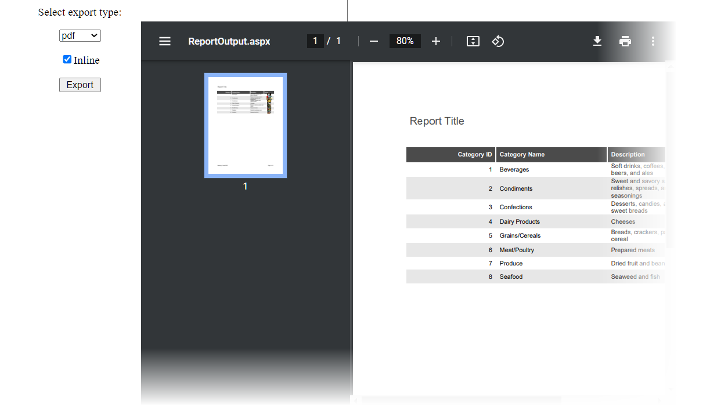

<!-- default badges list -->

<!-- default badges end -->
# Reporting for Web Forms -  Export a Report in Code

This example usses the Response.BinaryWrite method to export an XtraReport instance in an ASP.NET application.

Select the export file format and specify whether the exported document should be displayed in the same browser window (inline). Click the "Export" button. The report is created and stored in the `Session` variable. The user is redirected to the `ReportOutput.aspx` page. The report is obtained from `Session` and exported to the specified format.

## Files to Review

* [XtraReport1.cs](./CS/WebSiteExportTest/App_Code/XtraReport1.cs) (VB: [XtraReport1.vb](./VB/WebSiteExportTestVB/App_Code/XtraReport1.vb))
* [Default.aspx](./CS/WebSiteExportTest/Default.aspx) (VB: [Default.aspx](./VB/WebSiteExportTestVB/Default.aspx))
* [Default.aspx.cs](./CS/WebSiteExportTest/Default.aspx.cs) (VB: [Default.aspx.vb](./VB/WebSiteExportTestVB/Default.aspx.vb))
* [ReportOutput.aspx](./CS/WebSiteExportTest/ReportOutput.aspx) (VB: [ReportOutput.aspx](./VB/WebSiteExportTestVB/ReportOutput.aspx))
* [ReportOutput.aspx.cs](./CS/WebSiteExportTest/ReportOutput.aspx.cs) (VB: [ReportOutput.aspx.vb](./VB/WebSiteExportTestVB/ReportOutput.aspx.vb))

## Documentation

- [Printing and Export in Reporting Tools for Web](https://docs.devexpress.com/XtraReports/404502/web-reporting/common-features/printing)
- [Export Reports](https://docs.devexpress.com/XtraReports/1302/detailed-guide-to-devexpress-reporting/store-and-distribute-reports/export-reports)

## More Examples

- [Reporting for ASP.NET WebForms - How to print or export a report without showing a preview](https://github.com/DevExpress-Examples/reporting-webforms-print-export-report-without-showing-a-preview)
<!-- feedback -->
## Does this example address your development requirements/objectives?

 

(you will be redirected to DevExpress.com to submit your response)
<!-- feedback end -->
